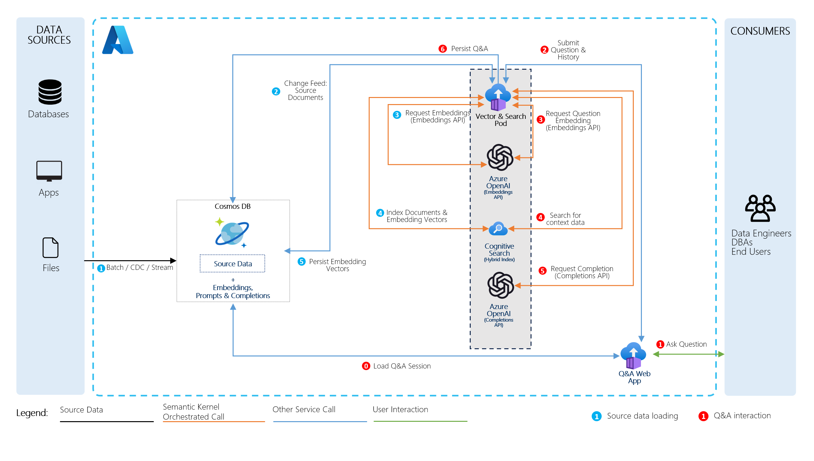

# Build & Modernize AI Applications

This page is intended as a home page for all of the Microsoft Official Build & Modernize AI Applications reference solutions and content. The projects listed below provide access to the published Microsoft content on how to build AI-enabled applications using Azure OpenAI Service, Azure Container Apps (or Azure Kuberntes Service), Azure Cosmos DB and Azure Cognitive Search.

## Solutions

The Solution Accelerators below are designed to demonstrate how to build AI-enabled applications and services in Azure. These solutions can be forked or cloned to help build prototypes for your organizations, helping you get started and reduce time to market. Each of the solution accelerator solutions below are also accompanied by a 1-2 day hackathon that provide a series of challenges for users to learn the concepts, technical skills and Azure Services used to build these types of applications.

### Vector Search & AI Assistant (Official Solution Accelerator)

[Navigate to Vector Search & AI Assistant](https://github.com/AzureCosmosDB/VectorSearchAiAssistant/tree/cognitive-search-vector)

The scenario for this sample centers around a consumer retail "Intelligent Agent" that allows users to ask questions (RAG Pattern) on vectorized product, customer and sales order data stored in the database. The data in this solution is from the [Cosmic Works sample](https://github.com/azurecosmosdb/cosmicworks) for Azure Cosmos DB and adapted from the Adventure Works 2017 SQL database sample for a retail Bike Shop that sells bicycles, biking accessories, components and clothing.

[Build Modern AI Apps Hackathon Content](https://github.com/AzureCosmosDB/OpenAIHackathon)

### Real-Time Payment and Transaction Processing

[Navigate to Real-Time Transaction Payment Processing](https://github.com/AzureCosmosDB/RealTimeTransactions)

The scenario centers around a payments and transactions solution. Members having accounts, each account with corresponding balances, overdraft limits and credit/debit transactions. Transaction data is replicated across multiple geographic regions for both reads and writes, while maintaining consistency. Updates are made efficiently with the patch operation. Business rules govern if a transaction is allowed. An AI powered co-pilot enables agents to analyze transactions using natural language.

[Real Time Transactions Hackathon Content](https://github.com/AzureCosmosDB/RealTimeTransactionsHackathon)

### Medical Claims Processing

[Navigate to Medical Claims Processing](https://github.com/AzureCosmosDB/ClaimsProcessing)

The scenario centers around a medical claims management solution. Members having coverage and making claims, providers who deliver services to the member and payers who provide the insurance coverage that pays providers for services to the members. Claims submitted are submitted in a stream and loaded into the backing database for review and approval. Business rules govern the automated or human approval of claims. An AI powered co-pilot empowers agents with recommendations on how to process the claim.

[Claims Processing Hackathon Content](https://github.com/AzureCosmosDB/ClaimsProcessingHackathon)

## Contributing

This project welcomes contributions and suggestions.  Most contributions require you to agree to a
Contributor License Agreement (CLA) declaring that you have the right to, and actually do, grant us
the rights to use your contribution. For details, visit https://cla.opensource.microsoft.com.

When you submit a pull request, a CLA bot will automatically determine whether you need to provide
a CLA and decorate the PR appropriately (e.g., status check, comment). Simply follow the instructions
provided by the bot. You will only need to do this once across all repos using our CLA.

This project has adopted the [Microsoft Open Source Code of Conduct](https://opensource.microsoft.com/codeofconduct/).
For more information see the [Code of Conduct FAQ](https://opensource.microsoft.com/codeofconduct/faq/) or
contact [opencode@microsoft.com](mailto:opencode@microsoft.com) with any additional questions or comments.

## Trademarks

This project may contain trademarks or logos for projects, products, or services. Authorized use of Microsoft 
trademarks or logos is subject to and must follow 
[Microsoft's Trademark & Brand Guidelines](https://www.microsoft.com/en-us/legal/intellectualproperty/trademarks/usage/general).
Use of Microsoft trademarks or logos in modified versions of this project must not cause confusion or imply Microsoft sponsorship.
Any use of third-party trademarks or logos are subject to those third-party's policies.
